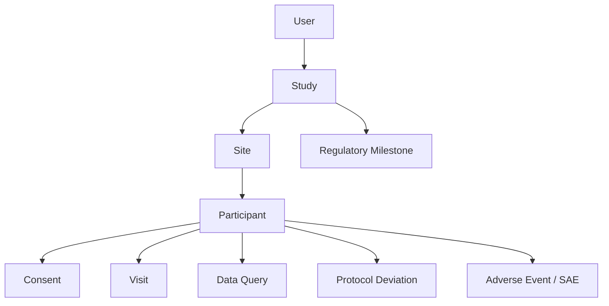

# AIIA TrialOrbit
**Real-Time Clinical Trial Management & Monitoring Platform**


AIIA TrialOrbit is a role-based, real-time Clinical Trial Management System (CTMS) designed around the All India Institute of Ayurveda (AIIA) clinical research environment. This project addresses the **Smart India Hackathon 2026 Problem Statement 26046 (Ministry of Ayush / AIIA)**.

---

## 📖 Table of Contents
1. [Problem Statement & Objectives](#problem-statement--objectives)
2. [What is AIIA TrialOrbit?](#what-is-aiia-trialorbit)
3. [User Roles (RBAC)](#user-roles-rbac)
4. [Key Features & Modules](#key-features--modules)
5. [Dashboard Overviews](#dashboard-overviews)
6. [System Architecture & Tech Stack](#system-architecture--tech-stack)
7. [Data Model](#data-model)
8. [Security & Compliance](#security--compliance)
9. [Clinical & Regulatory Standards](#clinical--regulatory-standards)
10. [Local Setup & Deployment](#local-setup--deployment)
11. [Testing](#testing)
12. [Known Limitations](#known-limitations)
13. [Roadmap](#roadmap)

---

## 🎯 Problem Statement & Objectives

**Problem:** Clinical research activities often become fragmented across spreadsheets, documents, and disconnected legacy systems. This leads to delayed status visibility, manual tracking of milestones, disconnected safety workflows, and difficulty maintaining real-time compliance oversight.

**Solution:** TrialOrbit provides a unified, real-time CTMS that seamlessly integrates study management, multi-site tracking, participant recruitment, data quality checks, pharmacovigilance (SAE/ADR), and ethics oversight into a single role-based dashboard.

---

## 🚀 What is AIIA TrialOrbit?

TrialOrbit is an institutional software platform designed to manage the entire lifecycle of Ayurvedic and integrative clinical research. Instead of treating clinical tracking as a set of flat files, it leverages real-time WebSocket connectivity (`Socket.IO`), high-performance caching (`Redis`), and strict Role-Based Access Control (`RBAC`) to ensure every stakeholder sees exactly the data they need, instantly.

---

## 👥 User Roles (RBAC)

The application enforces strict vertical authorization across exactly 7 canonical roles.

| Role | Purpose | Features Accessed |
|---|---|---|
| **ADMIN** | Institutional system administration | Full system settings, User Management, Global KPIs |
| **PI** | Principal Investigator | Study oversight, Recruitment, Protocol management, Data exports |
| **COORDINATOR** | Site-level operations | Participant logs, Visit scheduling, Consent tracking |
| **MONITOR** | Clinical monitoring & data quality | SDV, Raise Data Queries, Flag Protocol Deviations |
| **ETHICS** | Institutional Ethics Committee (IEC) | Protocol review, Ethics compliance, Regulatory timeline tracking |
| **PHARMACOVIGILANCE** | PV Officer / Safety | Review AEs/ADRs/SAEs, Enforce reporting deadlines |
| **REGULATOR** | Regulatory Authority / Auditing | **READ-ONLY** access to safety signals, milestones, and audit logs |

---

## ✨ Key Features & Modules

*Based on current implementation status.*

| Module / Feature | Status |
|---|---|
| **Authentication (JWT, Logout, Blacklisting)** | ✅ Implemented |
| **Role-Based Access Control (RBAC)** | ✅ Implemented |
| **Study & Site Management** | ✅ Implemented |
| **Participant & Recruitment Tracking** | ✅ Implemented |
| **Visit Scheduling** | ✅ Implemented |
| **Data Queries & Protocol Deviations** | ✅ Implemented |
| **Pharmacovigilance (AE/ADR/SAE Workflow)** | ✅ Implemented |
| **Real-Time Alerts (Socket.IO + Redis)** | ✅ Implemented |
| **Role-Specific Dashboards** | ✅ Implemented |
| **Audit Trail** | ✅ Implemented |
| **CDISC / FHIR Export Interoperability** | ⚠️ Prototype |

---

## 📊 Dashboard Overviews

Each login is dynamically routed to a customized, widget-driven interface tailored to their exact operational scope:
- **Admin:** System-wide operations, active users, alert tracking.
- **PI:** Scoped recruitment charts, pending signatures, safety signals.
- **Coordinator:** Participant visit calendars, open queries.
- **Monitor:** Site compliance, protocol deviations, SDV status.
- **Ethics:** Review queues, SAE deadline flags, milestone progress.
- **Pharmacovigilance (PV):** Safety event aging, 24-hour SAE countdowns.
- **Regulator:** Global read-only compliance overview.

---

## 🏗️ System Architecture & Tech Stack

**Frontend:**
- **React 19** / **Vite 8**
- **React Router v7**
- **Axios** (API Client)
- **Recharts** (Data Visualization)
- **Socket.IO-Client** (Real-time updates)
- Custom Vanilla CSS + responsive flexbox/grid layouts

**Backend:**
- **Node.js** / **Express 5**
- **MongoDB** / **Mongoose 9** (Primary Data Store)
- **Redis** (Token blacklisting, Rate-limiting, Cache)
- **Socket.IO** (Real-time rooms and event emission)
- **JWT** (Stateless authentication with JTI tracking)
- **Joi** (Strict payload validation)

**Data Flow:**
1. Frontend makes authenticated Axios request.
2. Backend verifies JWT and checks Redis blacklist.
3. RBAC Middleware checks user role against endpoint permission.
4. Joi validates the request body.
5. Controller delegates to Service, interacting with Mongoose Repositories.
6. Service commits to MongoDB (Source of Truth).
7. If data triggers an alert/state change, Service emits a real-time event via Socket.IO to authorized rooms.

---

## 🗄️ Data Model

*Simplified Entity Relationship Mapping.*



**Key Collections:**
`Users`, `Studies`, `Sites`, `Participants`, `Visits`, `AdverseEvents`, `Alerts`, `DataQueries`, `ProtocolDeviations`, `AuditLogs`, `RegulatoryMilestones`, `Consents`.

---

## 🛡️ Security & Compliance

This platform is designed with foundational security principles required for healthcare data:
- **Authentication:** JWT tokens with expiration, `jti` tracking, and Redis-backed immediate revocation on logout.
- **Authorization:** Backend endpoint protection matching UI constraints. Hardened against IDOR (Insecure Direct Object Reference) by scoping database queries to the user's explicit assigned `studyId` or `siteId`.
- **API Protection:** Global rate-limiting via Redis, Helmet for HTTP headers, CORS configurations.
- **Audit Logging:** Implemented tracking for sensitive CRUD operations.

*(Note: While designed around ICMR/GCP standards, this prototype is not formally certified for production deployment.)*

---

## ⚕️ Clinical & Regulatory Standards

| Standard | Current Implementation Status |
|---|---|
| **GCP-ASU / ICMR Guidelines** | ✅ Implemented (RBAC, Safety workflows) |
| **NDCT Rules 2019** | ✅ Implemented (SAE 24h timelines) |
| **ALCOA+** | ✅ Implemented (Audit trails, non-destructive updates) |
| **CDISC (SDTM/CDASH)** | ⚠️ Prototype (Export structure foundation) |
| **HL7 FHIR R4** | ⚠️ Prototype (Schema alignment) |

---

## 💻 Local Setup & Deployment

### Prerequisites
- Node.js (v18+)
- MongoDB (Local or Atlas URL)
- Redis Server (Running locally or cloud)

### Environment Variables
Create a `.env` file in the `backend/` directory:
```env
PORT=3000
MONGODB_URI=mongodb://localhost:27017/trialorbit
MONGODB_TEST_URI=mongodb://localhost:27017/trialorbit_test
JWT_SECRET=your_super_secret_key_change_me
REDIS_URL=redis://localhost:6379
FRONTEND_URL=http://localhost:5173
```

### Run Locally
```bash
# Terminal 1: Backend
cd backend
npm install
npm run seed  # Optional: Generates demo data
npm run dev

# Terminal 2: Frontend
cd frontend
npm install
npm run dev
```

---

## 🧪 Testing

The platform has undergone intense, zero-tolerance E2E and Unit testing:
- **Backend (Jest):** `123 / 123` Tests Passed (19 Test Suites)
- **Frontend (Playwright):** `44 / 44` E2E Scenarios Passed
- **Build Integrity:** `Vite Build` verified.
- **Responsive Matrix Verified:** `320x568` up to `1920x1080`.

To run tests:
```bash
# Backend
cd backend && npm test

# Frontend (Playwright)
cd frontend && npx playwright test
```

---

## ⚠️ Known Limitations
- **Prototype Integration:** FHIR and CDISC modules represent architectural foundations (export schemas) but are not currently wired to live external EMR/EHR hospitals.
- **Dictionary Lookups:** Adverse Event coding (MedDRA/WHO Drug) is structured in the database schema but relies on manual entry rather than a live licensed API integration.
- **Regulatory Status:** This is a Smart India Hackathon prototype and must undergo rigorous penetration testing and compliance auditing before true clinical deployment.

---

## 🗺️ Roadmap
- [x] **Phase 1:** Core CTMS & RBAC
- [x] **Phase 2:** Real-Time Safety & Alert Workflows
- [ ] **Phase 3:** Live EHR Integration via FHIR
- [ ] **Phase 4:** Fully Validated CDISC Export Engine
- [ ] **Phase 5:** Predictive AI for Site Performance Risk

---
*Developed for the Ministry of Ayush by Team AsyncOrbit.*